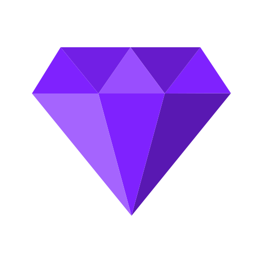

<h1 align="center">
  Amethyst
</h1>

  

  <strong>Home Media Application</strong>

---

A full-stack monorepo containing the:

- Backend: Java 21/Maven/Spring Boot
- Web: Vue.js

## Scripts

- `pnpm dev` start the stack
- `pnpm dev:web` start just the web frontend
- `pnpm dev:backend` start just the backend

## Requirements

- Java 21+
- `ffmpeg` installed locally

## Swagger

An API dashboard is available when the backend is running: [Swagger](http://localhost:8080/swagger-ui/index.html#/)

## SDK

An SDK can be generated with the command `pnpm generate-sdk` which runs the `openapi-generator-cli` tool on a **running** backend to generate typescript schemas based on the backend models.

This is helpful as it reduces the amount of typescript schemas we have to maintain.

## Authenticating

The default admin credentials are `admin:Admin123!`

1. Hit `/auth/login` endpoint with the body: `{ "username": "admin", "password": "Admin123!" }`
2. An access token is granted in the `Authorization` header, and is required for all API requests.
3. A refresh token is also granted in your Cookies (`refreshToken` cookie), and has a longer lifespan. To avoid logging in every time, hit `/api/refresh`. This will grant another `Authorization` access token

## API testing

With the backend running:

1. Navigate to Swagger
2. Click "Authorize", and paste in your `Bearer ey...` access token
